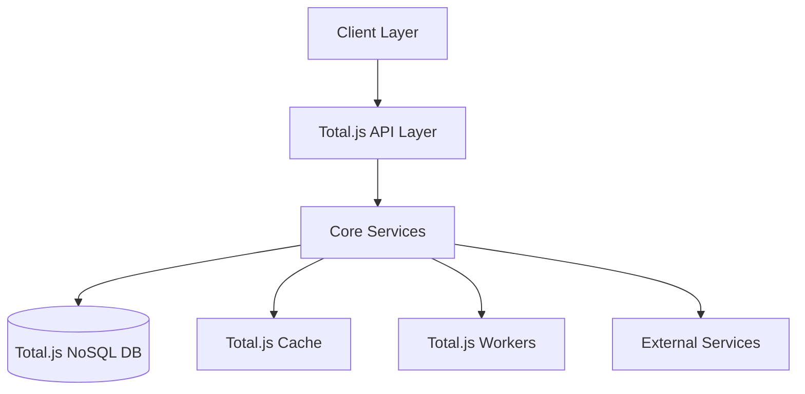
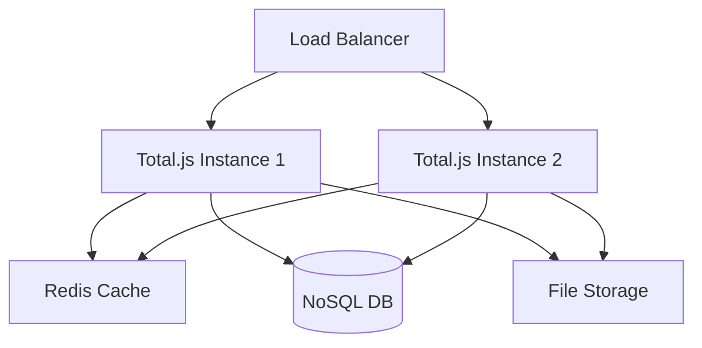

# Event Control System Architecture

## System Overview

### High-Level Architecture


## Components

### 1. Total.js Framework Integration

#### Core Configuration
```javascript
// config
CONF.version = '1.0.0';
CONF.database = process.env.DB_PATH;
CONF.secret = process.env.SECRET_KEY;
CONF.cookie = CONF.cookie_secret;

// Cache settings
CONF.allow_cache = true;
CONF.allow_cache_snapshot = true;
CONF.allow_cache_clear = true;
CONF.default_maxage = '5 minutes';
```

#### Middleware Chain
```javascript
// Security middleware
MIDDLEWARE('cors');
MIDDLEWARE('limit');

// Authentication
MIDDLEWARE('auth');

// Request processing
MIDDLEWARE('body');
MIDDLEWARE('upload');
```

### 2. Database Architecture

#### NoSQL Schema
```javascript
// Event schema
NEWSCHEMA('Event', function(schema) {
    schema.define('id', String);
    schema.define('name', String, true);
    schema.define('type', ['conference', 'meeting', 'emergency']);
    schema.define('status', ['draft', 'active', 'cancelled']);
    schema.define('priority', ['low', 'medium', 'high', 'critical']);
    schema.define('location', String);
    schema.define('startDate', Date);
    schema.define('endDate', Date);
    schema.define('metadata', Object);
});

// Incident schema
NEWSCHEMA('Incident', function(schema) {
    schema.define('id', String);
    schema.define('title', String, true);
    schema.define('eventId', String);
    schema.define('status', ['open', 'investigating', 'resolved']);
    schema.define('priority', ['low', 'medium', 'high', 'critical']);
});
```

#### Database Operations
```javascript
// Database worker
NEWOPERATION('db_backup', function($) {
    BACKUP(function(err, filename) {
        if (err)
            $.invalid(err);
        else
            $.success(filename);
    });
});

// Database maintenance
SCHEDULE('1 day', 'cleanup');
```

### 3. Service Layer

#### Event Service
```javascript
// Event service operations
NEWOPERATION('events/create', function($) {
    var model = $.model;
    model.id = UID();
    model.created = NOW;
    
    NOSQL('events').insert(model)
        .callback($.done());
});

// Event search with caching
NEWOPERATION('events/search', function($) {
    var opt = $.options;
    
    CACHED('events', opt.key, '5 minutes', function(next) {
        NOSQL('events')
            .search('name', opt.search)
            .where('type', opt.type)
            .page(opt.page, opt.limit)
            .callback(next);
    }, $.callback);
});
```

#### WebSocket Service
```javascript
// WebSocket routing
NEWSCHEMA('WebSocket', function(schema) {
    schema.define('type', ['auth', 'subscribe', 'unsubscribe']);
    schema.define('channel', String);
    schema.define('data', Object);
});

// WebSocket controller
ON('websocket', function(client, message) {
    switch (message.type) {
        case 'auth':
            // Handle authentication
            break;
        case 'subscribe':
            // Handle subscription
            client.subscribe(message.channel);
            break;
    }
});
```

### 4. Security Architecture

#### Authentication
```javascript
// JWT configuration
AUTH(function($) {
    if ($.cookie('token')) {
        // Verify token
        JWT.verify($.cookie('token'), CONF.secret, function(err, decoded) {
            if (err)
                $.invalid();
            else
                $.success(decoded);
        });
    } else
        $.invalid();
});

// Role definitions
AUTH.role('admin', ['users.manage', 'system.configure']);
AUTH.role('manager', ['events.manage', 'incidents.manage']);
```

#### Request Validation
```javascript
// Request schema validation
NEWSCHEMA('Request', function(schema) {
    schema.define('token', String, true);
    schema.define('data', Object);
    
    schema.addValidation('token', function(value) {
        return value.length === 32;
    });
});
```

### 5. Caching Strategy

#### Multi-Level Caching
```javascript
// Memory cache
CACHE('memory', '5 minutes');

// File cache for larger objects
CACHE('files', '1 hour');

// Database query cache
CACHE('query', '30 minutes', true);
```

#### Cache Operations
```javascript
// Cache management
ON('service', function(counter) {
    if (counter % 10 === 0)
        CACHE.clear();
});

// Snapshot caching
ON('ready', function() {
    CACHE.snapshot();
});
```

### 6. Worker Architecture

#### Background Jobs
```javascript
// Worker process
NEWOPERATION('worker/backup', function($) {
    // Perform backup in worker
    F.worker('backup', 'backup.js', function(err, response) {
        if (err)
            $.invalid(err);
        else
            $.success(response);
    });
});

// Scheduled tasks
SCHEDULE('23:00', 'cleanup');
SCHEDULE('*/10 * * * *', 'monitor');
```

### 7. Integration Architecture

#### External Services
```javascript
// Weather service integration
NEWOPERATION('weather/get', function($) {
    RESTBuilder.GET('https://api.weather.com/v1/current')
        .header('key', CONF.weather_key)
        .query('location', $.query.location)
        .exec($.callback);
});

// Emergency service
NEWOPERATION('emergency/notify', function($) {
    MESSAGE.send($.model.to, 'EMERGENCY', $.model)
        .callback($.done());
});
```

## Performance Considerations

### Optimization Strategies
1. **Database Optimization**
   - Indexing: `NOSQL('events').index('type date')`
   - Query caching: `CACHED('events', key, '5 minutes')`
   - Batch operations: `BATCH('events', operations)`

2. **Resource Management**
   - Memory limits: `CONF.memory = 1024`
   - Connection pooling: `CONF.connection_pool = 100`
   - File upload limits: `CONF.upload_limit = '50MB'`

3. **Caching Strategy**
   - Response caching: `CACHE('responses', '5 minutes')`
   - Static file caching: `CONF.static_cache = '1 month'`
   - Database result caching: `CONF.db_cache = true`

## Deployment Architecture

### Infrastructure


### Scaling Strategy
1. **Horizontal Scaling**
   - Multiple Total.js instances
   - Load balancer configuration
   - Session sharing via Redis

2. **Vertical Scaling**
   - Resource optimization
   - Worker processes
   - Memory management

3. **Database Scaling**
   - Replication
   - Sharding
   - Backup strategy 