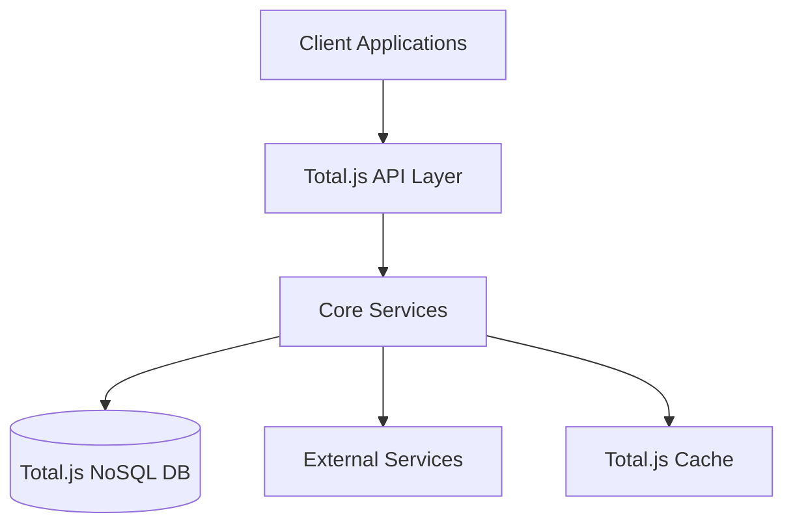

# Event Control System - Administrator Guide

## System Overview

### Architecture


## Administrative Tasks

### User Management
1. **Creating Users**
   ```http
   POST /api/admin/users
   Content-Type: application/json
   Authorization: Bearer <admin_token>

   {
     "username": "user123",
     "email": "user@example.com",
     "role": "manager",
     "permissions": ["events.create", "incidents.view"]
   }
   ```

2. **Managing Roles**
   - View roles: `GET /api/admin/roles`
   - Create role: `POST /api/admin/roles`
   - Update role: `PUT /api/admin/roles/{id}`
   - Delete role: `DELETE /api/admin/roles/{id}`

3. **User Operations**
   - Reset password
   - Lock/unlock accounts
   - Manage permissions
   - View audit logs

### System Configuration

#### Environment Variables
```bash
# Server Configuration
PORT=8000
NODE_ENV=production
DEBUG=true

# Database Configuration
DB_PATH=/data/db
DB_BACKUP_PATH=/data/backup

# API Keys
OPENWEATHER_API_KEY=xxx
EMERGENCY_API_KEY=xxx
TWILIO_ACCOUNT_SID=xxx
TWILIO_AUTH_TOKEN=xxx
```

#### Cache Configuration
```javascript
// Memory cache settings
CONF.cache_size = 1000;
CONF.cache_duration = '1 hour';

// Database cache
CONF.nosql_cache = true;
CONF.nosql_cache_size = 1000;
```

### Monitoring & Maintenance

#### System Health Checks
```http
GET /api/admin/health
Authorization: Bearer <admin_token>

Response:
{
    "status": "healthy",
    "uptime": "5d 12h",
    "memory": {
        "used": "512MB",
        "total": "1GB"
    },
    "cpu": "25%",
    "db": "connected",
    "cache": "operational"
}
```

#### Performance Monitoring
1. **Real-time Metrics**
   - Active users
   - Request rate
   - Error rate
   - Response times

2. **System Resources**
   - CPU usage
   - Memory usage
   - Disk space
   - Network traffic

### Backup & Recovery

#### Database Backup
```bash
# Manual backup
$ node backup.js --type=full

# Automated backups (configured in Total.js)
SCHEDULE('0 0 * * *', () => {
    EXEC('backup');
});
```

#### Recovery Procedures
1. **Database Recovery**
   ```bash
   # Restore from backup
   $ node restore.js --file=backup_2024_01_01.nosql
   ```

2. **System Recovery**
   - Stop services
   - Restore configuration
   - Restore data
   - Start services
   - Verify integrity

### Security Management

#### Access Control
```javascript
// Role-based access control
AUTH.role('admin', ['users.manage', 'system.configure']);
AUTH.role('manager', ['events.manage', 'incidents.manage']);
AUTH.role('user', ['events.view', 'incidents.report']);
```

#### Security Policies
1. **Password Policy**
   - Minimum length: 12 characters
   - Complexity requirements
   - Expiration: 90 days
   - History: 12 passwords

2. **Session Management**
   - Timeout: 30 minutes
   - Max concurrent: 3
   - IP restriction options
   - Activity logging

### Integration Management

#### External Services
1. **Weather Service**
   - API key management
   - Rate limit monitoring
   - Error handling
   - Cache configuration

2. **Emergency Services**
   - Connection status
   - Response time monitoring
   - Incident routing rules
   - Backup procedures

### Audit & Compliance

#### Audit Logs
```http
GET /api/admin/audit
Authorization: Bearer <admin_token>
Query: ?start=2024-01-01&end=2024-01-31

Response:
[
    {
        "timestamp": "2024-01-01T12:00:00Z",
        "action": "user.create",
        "actor": "admin",
        "target": "user123",
        "details": { ... }
    }
]
```

#### Compliance Reports
1. **Access Reports**
   - User access logs
   - Permission changes
   - Failed attempts
   - System access patterns

2. **Activity Reports**
   - Event statistics
   - Incident response times
   - System usage metrics
   - Performance trends

### Troubleshooting Guide

#### Common Issues
1. **Performance Issues**
   - Check cache hit rates
   - Monitor database queries
   - Review active connections
   - Analyze request patterns

2. **Integration Issues**
   - Verify API keys
   - Check rate limits
   - Monitor response times
   - Review error logs

#### Debug Mode
```javascript
// Enable debug mode
DEBUG=true node index.js

// Debug specific modules
DEBUG=auth,api,websocket node index.js
```

### System Updates

#### Update Procedure
1. **Preparation**
   - Backup database
   - Notify users
   - Schedule maintenance

2. **Execution**
   ```bash
   # Stop services
   $ node service.js stop

   # Update code
   $ git pull origin main

   # Update dependencies
   $ npm install

   # Run migrations
   $ node migrate.js

   # Start services
   $ node service.js start
   ```

3. **Verification**
   - Check system health
   - Verify integrations
   - Test core functions
   - Monitor logs

### Best Practices

#### Performance Optimization
1. **Cache Management**
   - Regular cache cleanup
   - Optimal cache sizes
   - Cache hit monitoring
   - Cache warming strategies

2. **Database Optimization**
   - Index maintenance
   - Query optimization
   - Regular cleanup
   - Performance monitoring

#### Security Measures
1. **Access Control**
   - Regular permission review
   - Access log monitoring
   - Failed login alerts
   - Session management

2. **Data Protection**
   - Encryption at rest
   - Secure communication
   - Regular backups
   - Data retention policies 