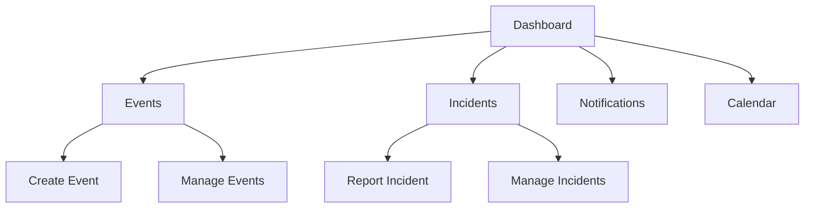

# Event Control System - User Guide

## Getting Started

### Account Setup
1. **Registration**
   - Navigate to the login page
   - Click "Register" button
   - Fill in required information:
     - Username
     - Email
     - Password (minimum 8 characters)
   - Verify your email address

2. **Login**
   - Enter your email and password
   - Enable two-factor authentication (recommended)
   - Set up notification preferences

### Dashboard Overview


## Event Management

### Creating Events
1. Click "Create Event" button
2. Fill in event details:
   - Name
   - Description
   - Type
   - Priority
   - Location (map or what3words)
   - Start/End dates
3. Add participants (optional)
4. Set notifications
5. Click "Create"

### Managing Events
- **View Events**
  - List view with filtering
  - Calendar view
  - Map view
- **Update Events**
  - Edit event details
  - Change status
  - Add/remove participants
- **Delete Events**
  - Archive vs Delete
  - Bulk operations

## Incident Management

### Reporting Incidents
1. Click "Report Incident" button
2. Select incident type:
   - Emergency
   - Security
   - Maintenance
   - Other
3. Set priority level
4. Provide location details
5. Add description
6. Upload attachments (if needed)
7. Submit report

### Tracking Incidents
- View incident status
- Add updates/comments
- Track response time
- View incident history
- Generate reports

## Location Services

### Using what3words
1. Click location field
2. Choose input method:
   - Map selection
   - what3words address
   - Coordinates
3. Verify location
4. Save changes

### Weather Information
- View current conditions
- Check forecast
- Set weather alerts
- Configure notifications

## Notifications

### Setting Up Notifications
1. Go to Profile Settings
2. Select "Notifications"
3. Configure preferences:
   - In-app notifications
   - Email notifications
   - SMS alerts
   - Priority thresholds

### Managing Notifications
- Mark as read
- Archive notifications
- Filter by type
- Set quiet hours

## Calendar Integration

### Connecting Calendars
1. Go to Settings
2. Select "Calendar Integration"
3. Choose calendar service:
   - Google Calendar
   - Outlook
   - iCal
4. Authorize access
5. Select sync options

### Using Calendar
- View events
- Set reminders
- Share calendars
- Export events

## Mobile Access

### Mobile Web Interface
- Responsive design
- Touch-optimized controls
- Offline capabilities
- Push notifications

### Location Services
- GPS integration
- Map navigation
- Offline maps
- Location sharing

## Troubleshooting

### Common Issues
1. **Login Problems**
   - Check email/password
   - Clear browser cache
   - Reset password if needed

2. **Notification Issues**
   - Check notification settings
   - Verify browser permissions
   - Update contact information

3. **Location Services**
   - Enable location access
   - Update browser settings
   - Check internet connection

### Getting Help
- Contact support
- View FAQs
- Submit bug reports
- Request features

## Security Best Practices

### Account Security
- Use strong passwords
- Enable two-factor authentication
- Regular password changes
- Secure device logout

### Data Protection
- Sensitive information handling
- File encryption
- Secure communication
- Data backup

## Keyboard Shortcuts

### Navigation
```
Alt + E: Events
Alt + I: Incidents
Alt + N: Notifications
Alt + C: Calendar
Alt + S: Settings
```

### Actions
```
Ctrl + N: New Event
Ctrl + I: Report Incident
Ctrl + F: Search
Ctrl + S: Save Changes
Esc: Close/Cancel
```

## Updates and Maintenance

### System Updates
- Automatic updates
- Manual updates
- Update notifications
- Maintenance windows

### Data Management
- Regular backups
- Data retention
- Export options
- Privacy settings 